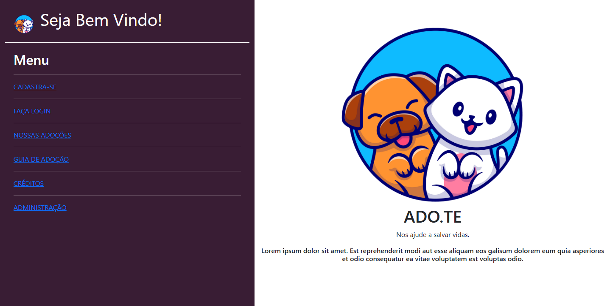
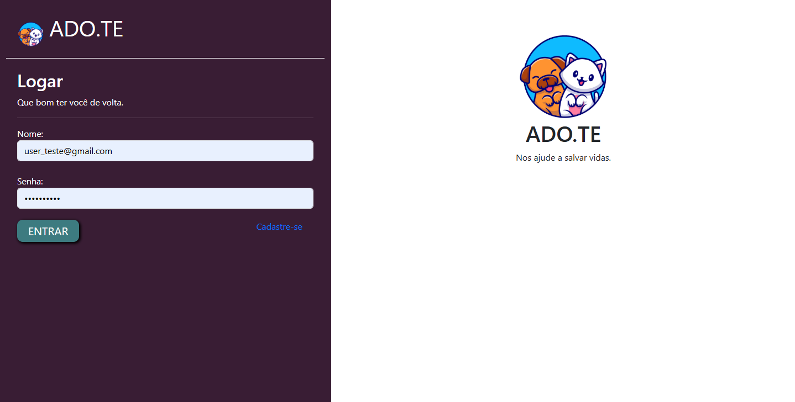
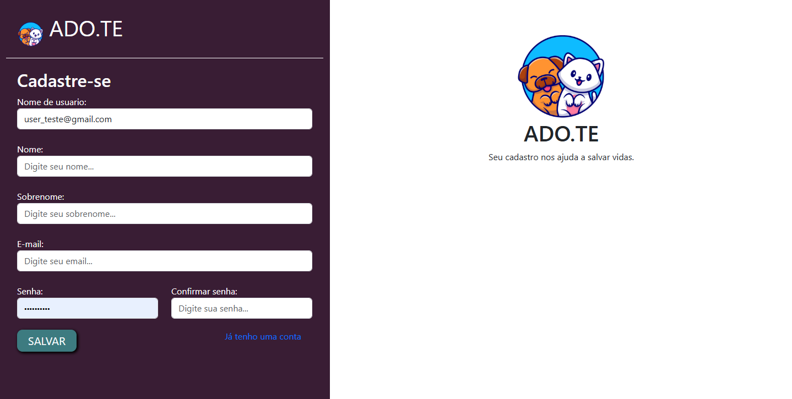
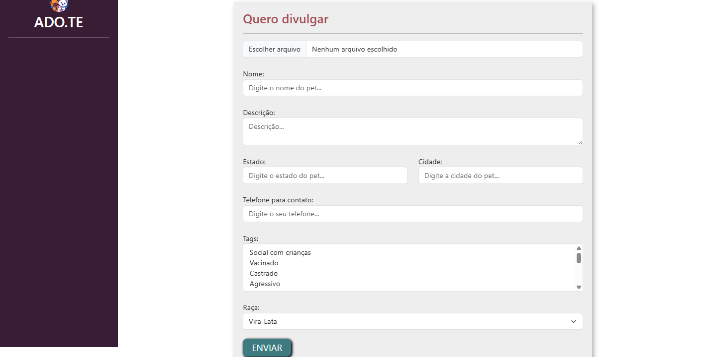
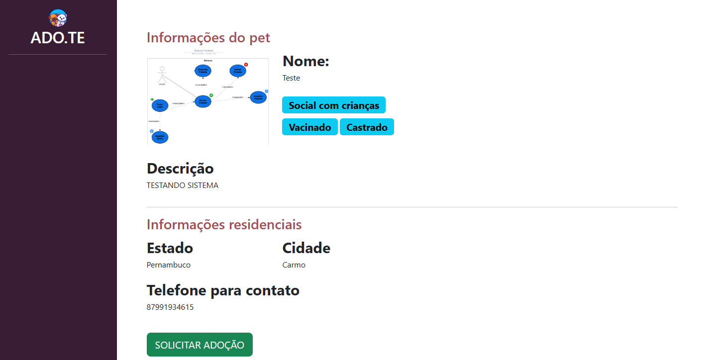
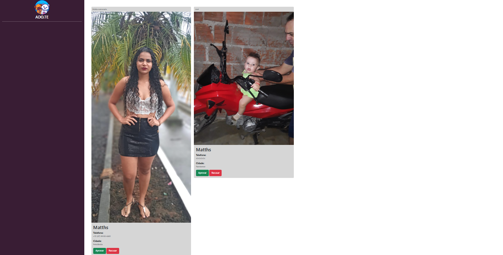

# Adote.me

### Sobre o Projeto

O **Adote.me** é um sistema web intuitivo e completo para a adoção de animais domésticos. O projeto foi desenvolvido com a missão de conectar pessoas que desejam adotar um pet com tutores que procuram um novo lar para seus animais. A plataforma oferece desde o cadastro de usuários até o gerenciamento e busca de pets, com funcionalidades que facilitam o processo de adoção.

## Funcionalidades Principais

  - **Cadastro e Autenticação de Usuários:** Sistema completo de registro e login, com gerenciamento de sessões para usuários e tutores.
  - **Gerenciamento de Pets:** Usuários podem cadastrar novos pets para adoção, editar suas informações e excluí-los da plataforma.
  - **Busca Avançada:** Interface de busca com filtros que permitem encontrar o pet ideal por **cidade** e/ou **raça**.
  - **Solicitação de Adoção:** Interessados podem enviar uma solicitação de adoção diretamente para o dono do pet, que pode aceitar ou recusar o pedido.
  - **Notificações por E-mail:** Envio de e-mail automático para o adotante quando a solicitação de adoção é aceita, garantindo uma comunicação rápida e eficiente.
  - **Análise de Dados:** Painel administrativo com gráficos que exibem dados relevantes sobre o sistema, como **Quantidade de adoções por raça**.

## Tecnologias Utilizadas

  - **Backend:**
      - Python
      - Django Framework
  - **Frontend:**
      - HTML5
      - CSS3
      - Bootstrap
      - JavaScript
  - **Banco de Dados:**
      - SQLite3
  - **Outras Ferramentas:**
      - `django-bootstrap-v5`, `Pillow` para upload de imagens, `anychart` para os gráficos
-----
## Estrutura de URL's
- `http://127.0.0.1:8000/admin/`
- `http://127.0.0.1:8000/auth/`
  - `http://127.0.0.1:8000/auth/cadastro/`
  - `http://127.0.0.1:8000/auth/login/`
  - `http://127.0.0.1:8000/auth/sair/`
- `http://127.0.0.1:8000/divulgar/`
  - `http://127.0.0.1:8000/divulgar/novo_pet/`
  - `http://127.0.0.1:8000/divulgar/seus_pets/`
  - `http://127.0.0.1:8000/divulgar/dashboard/`
  - `http://127.0.0.1:8000/divulgar/ver_pedido_adocao/`
  - `http://127.0.0.1:8000/divulgar/ver_pet/<id>/`
  - `http://127.0.0.1:8000/divulgar/remover_pet/<id>/`
-----
## Como Rodar o Projeto

### Pré-requisitos

Certifique-se de ter o Python 3 e o `pip` instalados em sua máquina.

### Instalação

1.  Clone o repositório:

    ```bash
    git clone https://github.com/Matheo-Henrique-Moura-Silva/gerenciador-adocao-pets-django.git
    ```

2.  Navegue até o diretório do projeto:

    ```bash
    cd gerenciador-adocao-pets-django-main
    ```

3.  Crie e ative um ambiente virtual (recomendado):

    ```bash
    python -m venv venv
    source venv/bin/activate  # Para Linux/macOS
    venv\Scripts\activate      # Para Windows
    ```

4.  Instale as dependências:

    ```bash
    pip install -r requirements.txt
    ```

5.  Execute as migrações do banco de dados:

    ```bash
    python manage.py makemigrations
    python manage.py migrate
    ```

6.  Crie um superusuário para acessar o painel administrativo:

    ```bash
    python manage.py createsuperuser
    ```

7.  Inicie o servidor de desenvolvimento:

    ```bash
    python manage.py runserver
    ```

Acesse o sistema no seu navegador em: `http://127.0.0.1:8000/`.

-----
# IMAGENS






-----
